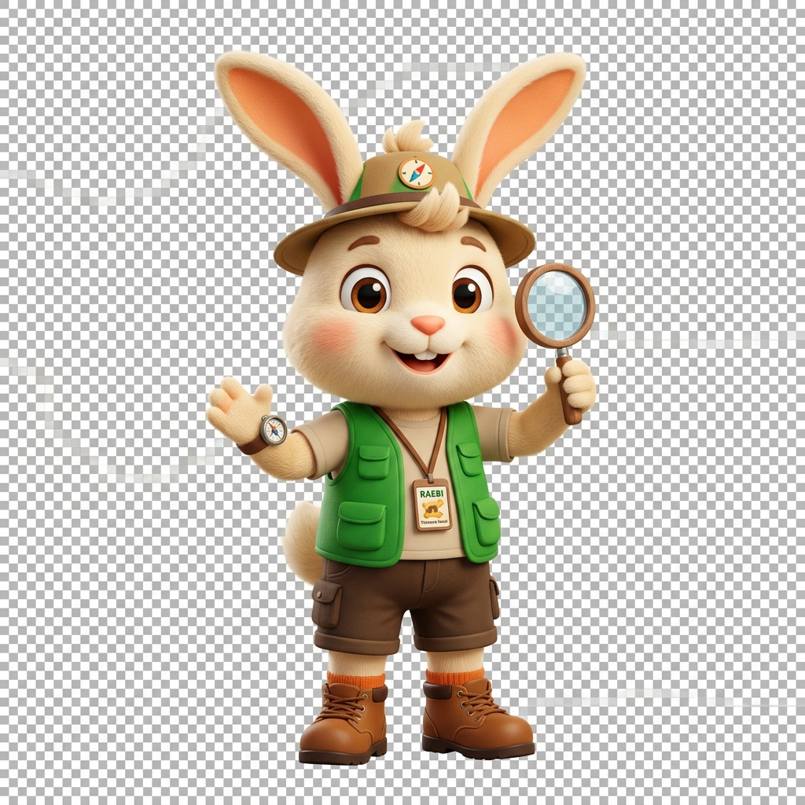

# 🛰️ Art Valley: 우주 신호 해독 센터 (Morse Code Decoder)

아트밸리 천문과학관을 위한 인터랙티브 우주 신호 해독 시스템입니다. 우주에서 온 수수께끼의 모스 부호를 해독하고, 우주 분석가 인증서를 획득하세요!

## ✨ 주요 기능 (Key Features)

- **🌌 시네마틱 연출**: 해독 성공 시 신호 스캐닝 및 데이터 분석 과정을 보여주는 몰입감 넘치는 트랜지션 효과.
- **🏆 우주 분석가 인증서**: 해독 성공 시 본인의 이름을 입력하고 우주 테마의 공식 인증서를 생성 및 저장 가능.
- **📟 실시간 모스 부호 해독**: 직관적인 모동 가이드와 슬롯 기반의 입력 인터페이스.
- **📸 이미지 저장 기능**: `html2canvas`를 활용하여 생성된 인증서를 고해상도 PNG 이미지로 즉시 저장.
- **🎵 오디오 피드백**: 시스템 가동 및 성공 시 배경음악과 효과음 지원 (브라우저 정책에 최적화).

## 🛠 사용 기술 (Tech Stack)

- **Frontend**: HTML5, Vanilla CSS3 (Custom Glassmorphism Design)
- **Logic**: Pure JavaScript (ES6+)
- **Library**: [html2canvas](https://html2canvas.hertzen.com/) (인증서 캡처용)
- **Fonts**: Orbitron, Noto Sans KR (Google Fonts)

## 🐾 마스코트 친구들 (Mascots)

| 도기 (Dogi) | 래비 (Raebi) | 캐티 (Caeti) |
| :---: | :---: | :---: |
|  |  |  |
| 든든한 탐험 대장 | 영리한 길잡이 | 호기심 많은 분석가 |

## 🚀 시작하기 (Getting Started)

1. 이 저장소를 클론하거나 HTML 파일을 다운로드합니다.
2. `index.html` 파일을 브라우저에서 엽니다.
3. **"관측 시작하기"** 버튼을 눌러 시스템을 가동합니다.
4. 그리드에서 문자를 선택하여 정답(**STAR**)을 입력하세요!

---
© 2026 Art Valley Astronomical Observatory. All rights reserved.
